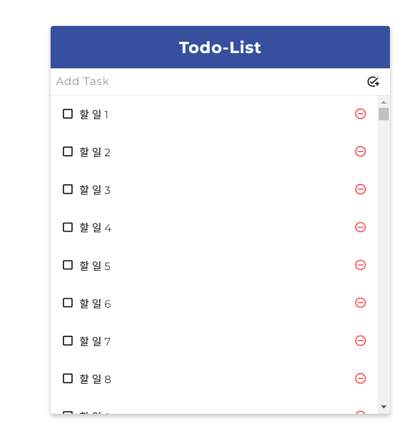

# Todo-react

- react의 기본기부터 컴포넌트 스타일링까지 방법을 토대로 side 프로젝트 일정 관리 애플리케이션 구현

- [document-react 레포지토리](https://github.com/parkgeonwoong/document-react)

 

## UI 구성 - 기획

1. TodoTemplate

   - 화면을 가운데 정렬, 앱 타이틀을 보여 준다. childern으로 내부 JSX를 props 받아와 렌더링

2. TodoInsert

   - 새로운 항목을 입력하고 추가할 수 있는 컴포넌트
   - state를 통해 인풋의 상태를 관리한다

3. TodoListItem

   - 각 할 일 항목에 대한 정보를 보여 주는 컴포넌트
   - todo 객체를 props로 받아와서 상태에 따라 다른 스타일의 UI를 보여줌

4. TodoList
   - todos 배열을 props로 받아 온 후, 이를 배열 내장 함수 map을 사용해 여러 개의 TodoListItem 컴포넌트로 변환해 보여준다

 

## 피드백

1. props를 보내는 것은 부모에서 부터 전달한다
2. DOM에서만 이벤트 핸들링을 줄 수 있다
3. 컴포넌트에서는 이벤트를 보내는 것이 아니라 props를 전달하는 모양이다
4. 배열 내장 함수 map, filter, concat를 활용을 잘 해야 한다
5. 배열 리스트를 받아서 하나하나 item으로 만드는 mapping 기술
6. 부모인 App에서 상태와 함수를 props로 전달하는 것
7. props 함수를 전달할 때는 useCallback hook을 사용하자
8. 참조하는 id 값은 useRef hook을 사용하자 ref -> current 꼭 사용하자
9. 이벤트 핸들링 onChange -> input, onSubmit -> form 에서 쓰자
10. filter은 조건에 따라 배열을 남기는 것이다

 

## 컴포넌트 성능 최적화

- 데이터가 무수히 많아지면 어떻게 관리할 것인가?
- 일부러 많은 데이터를 렌더링 해보고 모니터링을 해보자

 

### 느려지는 원인 분석

- 컴포넌트가 리렌더링을 자주 할수록 느려진다
  - 자신이 전달받은 props가 변경될 때
  - 자신의 state가 바뀔 때
  - 부모 컴포넌트가 리렌더링 될 때

 

## 피드백

리렌더링이 불필요할 때 어떻게 방지할까?

1. 함수형 컴포넌트니까 리렌더링 방지하는 Hook -> `react.memo`
2. 배열의 업데이트와 관련된 함수를 갱신
3. useState 함수형 업데이트 기능 사용 (업데이트를 정의로 고쳐보자)
4. useReducer hook을 사용해보자
5. react-virtualized를 사용해 렌더링 최적화도 가능 (사용자 화면에 맞춰 렌더링)

 

